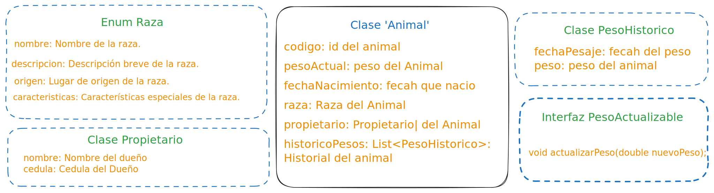

# Sistema de Gestión de Ganado Vacuno

> [!IMPORTANT]
> Este proyecto se encuentra actualmente en desarrollo activo. Ten en cuenta que el contenido y la funcionalidad pueden estar sujetos a cambios.


## Estructura del Proyecto

- **src/**: Contiene los archivos fuente en Java.
  - **objetos/**: Contiene las clases principales del sistema.
    - `Animal.java`: Representa un animal en el sistema.
    - `AnimalRepository.java`: Interfaz para la gestión de datos de animales.
    - `AnimalRepositoryImpl.java`: Implementación de la gestión de datos de animales.
    - `GestionGanado.java`: Clase principal que gestiona el funcionamiento del sistema.
    - `PesoHistorico.java`: Representa un registro histórico de pesajes.
    - `Propietario.java`: Representa a un propietario de animales.
    - `Raza.java`: Enum para las razas de los animales.
  - **interfaces/**: Contiene interfaces adicionales si es necesario.
  - **constantes/**: Contiene constantes utilizadas en el proyecto.

- **bin/**: Contiene los archivos `.class` generados después de la compilación.

- **db/**: Directorio para almacenar el archivo de datos `animales.dat`.

## Diagrama de Clases

A continuación se muestra un diagrama que ilustra las conexiones entre la clase `Animal` y otras clases relacionadas en el sistema.



## Requisitos

- **Java 21** o superior.
- Un entorno de desarrollo Java (como Visual Studio Code).

## Instalación y Configuración

1. **Clona el Repositorio**

   ```sh
   git clone https://github.com/Heimdall004/Sistema-Vacuno.git
   cd Sistema-Vacuno
   ```

2. **Compila el Proyecto**

   Asegúrate de tener todos los archivos `.java` en el directorio `src`. Luego, ejecuta el siguiente comando para compilar el proyecto:

   ```sh
   javac -d bin src/objetos/*.java src/interfaces/*.java src/constantes/*.java
   ```

3. **Crea el Directorio y Archivo de Datos**

   Si no existe, crea el directorio `db` y el archivo `animales.dat`:

   ```sh
   mkdir -p db
   touch src/db/animales.dat
   ```

## Uso

1. **Ejecutar el Programa**

   Ejecuta el programa principal desde el directorio raíz del proyecto:

   ```sh
   java -cp bin objetos.GestionGanado
   ```

2. **Agregar y Administrar Animales**

   - El programa permite registrar nuevos animales y actualizar su información de pesaje.
   - Los datos de los animales se almacenan en `db/animales.dat` y se cargan automáticamente al iniciar el programa.

3. **Guardar y Cargar Datos**

   - **Guardar Datos**: Los datos de los animales se guardan en un archivo `animales.dat`. La clase `AnimalRepositoryImpl` maneja la persistencia de datos.
     ```java
     animalRepository.guardarDatos(animales, ARCHIVO_DATOS);
     ```
   - **Cargar Datos**: Al iniciar el programa, se cargan los datos desde el archivo `animales.dat` para restaurar el estado del sistema.
     ```java
     animalRepository.cargarDatos(ARCHIVO_DATOS);
     ```

## Ejemplos

Aquí hay un ejemplo de cómo se podrían agregar y visualizar animales en el sistema:

- **Registro de un nuevo animal:**

   ```java
   Animal nuevoAnimal = new Animal(1, 250.0, new Date(), Raza.ANGUS, new Propietario("4836985","Juan Pérez"));
   animalRepository.agregarAnimal(nuevoAnimal);
   animalRepository.guardarDatos(animalRepository.obtenerTodosLosAnimales(), ARCHIVO_DATOS);
   ```

- **Visualización de todos los animales:**

   ```java
   Map<Integer, Animal> animales = animalRepository.obtenerTodosLosAnimales();
   for (Animal animal : animales.values()) {
       System.out.println(animal);
   }
   ```

## Contribuciones

Las contribuciones son bienvenidas. Si deseas contribuir a este proyecto, por favor sigue estos pasos:

1. **Fork el Repositorio**
2. **Crea una Rama para tu Feature o Bugfix**
3. **Haz un Commit con tu Cambio**
4. **Abre un Pull Request**

## Licencia

Este proyecto está licenciado bajo la Licencia MIT - ver el archivo [LICENSE](LICENSE) para detalles.